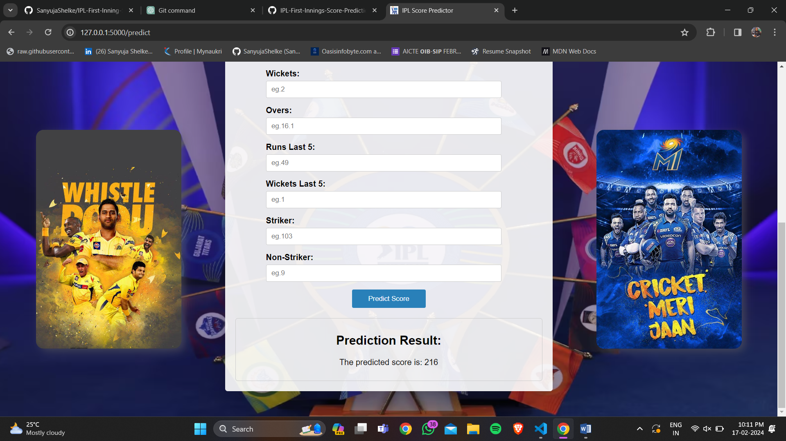

# IPL First Inning Score Predictor System

## Overview

This project uses machine learning techniques to predict the outcomes of IPL matches involving 14 teams. The dataset includes IPL match records from 2008 to 2018, and the goal is to accurately predict the outcomes of matches.

Based on the available data from 2008 to 2018, our machine learning model was trained and evaluated on matches involving the 14 teams that were present during that period. We did not include the two new teams introduced in 2022, Gujarat Titans and Lucknow Supergiants, due to the imbalance issue as we did not have sufficient data for these teams.

Therefore, the predictions made by our model should be interpreted with this limitation in mind. Nonetheless, our model can still provide valuable insights into the performance of the 14 teams that were present during the 2008-2018 period and can be used to make informed predictions about future matches involving these teams.

## Front Page of System

## Tip

Please use the provided Drive link to download the pickle file. Its size exceeds 100MB, making it unsuitable for GitHub upload. Thank you for your understanding.
[Drive Link](https://drive.google.com/file/d/1xgo7piCKb4ovUT5fi1itblfrPgISsh6l/view?usp=drive_link)